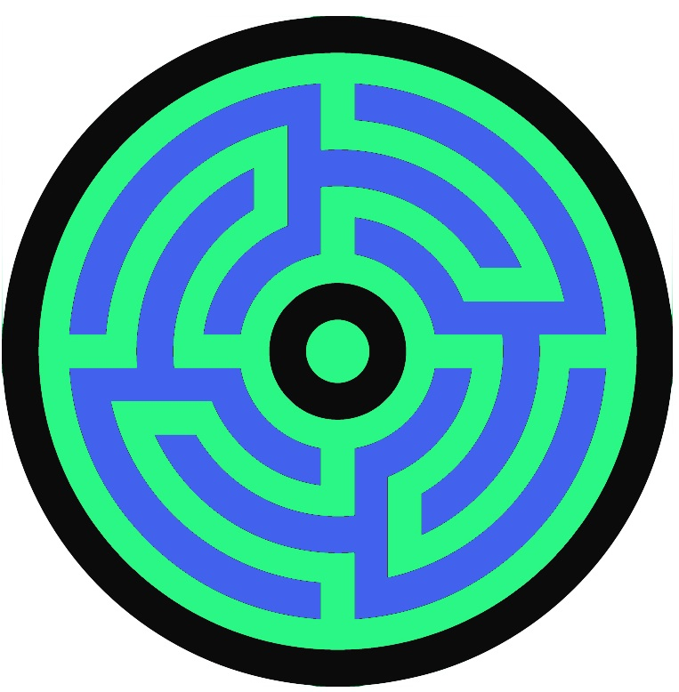

# Labyrinth


<a href="url"></a>

Package to compute netowrk parameters


<br><br><br>


Trying to recreate some of the functionality of [neo4j mazerunner](https://github.com/kbastani/neo4j-mazerunner) project, the handy work of [@kennybastani](https://twitter.com/kennybastani). I think that the capabilities are very cool. They utilize Neo4j, Docker and GraphX for each of thier strengths. For smaller networks though this can be a bit much. I have created something similar using igraph.

You first need the newest version of RNeo4j.


```
devtools::install_github("darrkj/labyrinth")

require(labyrinth)
```

Create connection to graph database

```
graph <- startGraph("http://localhost:7474/db/data/")
```

Run this for the example to work.
```
if(!exists('ingest')) {
  devtools::source_url("https://raw.githubusercontent.com/darrkj/RNeo4j/master/R/ingest.R")
}
```

This will add the commonly known Karate data to Neo4j

```
require(igraphdata)
data(karate)

ingest(karate, 'knows')
```


Check out what the data looks like.

```
getNodes(graph, 'match n where n.domain = "karate" return n')[1]

```

Nothing more than the data that was included from the Karate data set.
```
## $Faction
## [1] 1
## 
## $domain
## [1] "karate"
## 
## $name
## [1] "Mr Hi"
```


In the labyrinth project there is a function called mazewalker which can add network statistics to nodes
in Neo4j.

We can choose any number of local or global network measures. The first argument is a way to 
specify a particular sub-graph. Of you ignore it you just get the whole database.

```
mazeWalker('karate', 
           loc = c("degree", 'closeness', 'hub', 'eigenvector', 'page'), 
           glob = c('Assortativity', 'Clique', 'Diameter', 'Girth', 'Adhesion'))

```

Now we can re-query the database to see the new parameters that have been added.

```
getNodes(graph, 'match n where n.domain = "karate" return n')[1]
```
Lots of interesting things have appeared.
```
## $domain
## [1] "karate"
## 
## $name
## [1] "Mr Hi"
## 
## $Faction
## [1] 1
## 
## $Adhesion
## [1] "0"
## 
## $Girth
## [1] "3"
## 
## $Diameter
## [1] "5"
## 
## $Clique
## [1] "5"
## 
## $Assortativity
## [1] "-0.475613097684614"
## 
## $page
## [1] "0.0484986426941474"
## 
## $eigenvector
## [1] "0.952132366476656"
## 
## $hub
## [1] "0.952132366476656"
## 
## $closeness
## [1] "0.0282700421940928"
## 
## $degree
## [1] "32"
```


Global Measures
* Degree 
* Deg_Cent 
* Clos_Cent 
* Bet_Cent 
* Eig_Cent
* Assortativity 
* Avg_Path_Len 
* Clique  - Maximal Clique Size
* Diameter
* Radius 
* Girth 
* Adhesion 
* Density 
* Chordal 
* Connected - Boolean, is the graph connected


Local Measures
* degree
* closeness 
* betweeness
* eigenvector 
* hub 
* auth 
* page 
