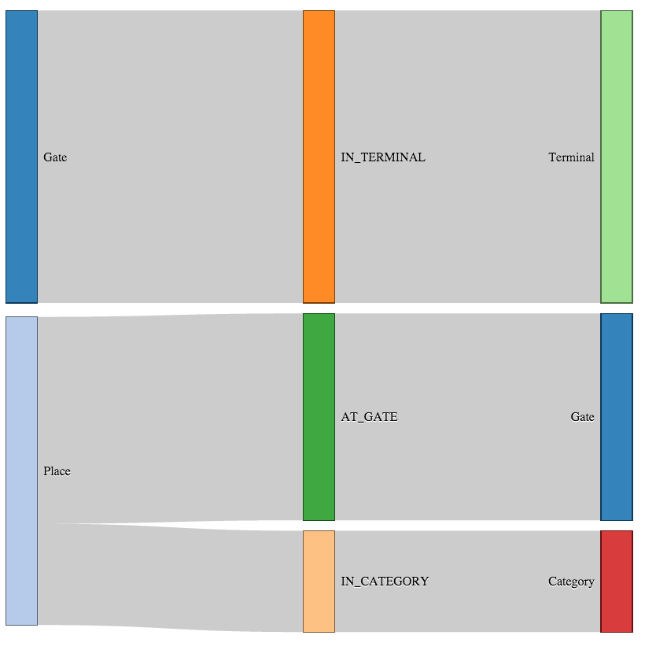

# Plot Relationships

```
library(RNeo4j)
library(labyrinth)

importSample(graph, "dfw")

neoSankey()
```

<a href="http://darrkj.github.io/blog/labyrinth/airport"></a>

[Interactive DFW](http://darrkj.github.io/blog/labyrinth/airport)  

[Interactive Movie](http://darrkj.github.io/blog/labyrinth/movies)
